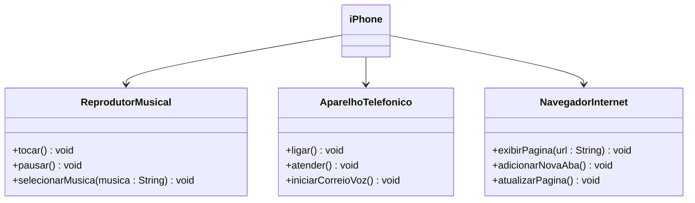

# 💻 Desafio: POO

## 🎯 Desafio

Funcionalidades a Modelar

1. Reprodutor Musical
    - Métodos: `tocar()`, `pausar()`, `selecionarMusica(String musica)`
2. Aparelho Telefônico
    - Métodos: `ligar(String numero)`, `atender()`, `iniciarCorreioVoz()`
3. Navegador na Internet
    - Métodos: `exibirPagina(String url)`, `adicionarNovaAba()`, `atualizarPagina()`

## Diagrama (Mermaid)

## 🧱 Ferramentas utilizadas

- Visual Studio Code
- [Draw IO](https://www.drawio.com/) - UML

## 🛠️ Links úteis

- [DIO](https://www.dio.me/)
- [Repositório do desafio](https://github.com/digitalinnovationone/trilha-java-basico/tree/main/desafios/poo)

## 🧑🏻‍💻 Autor

- [GitHub](https://github.com/GracilianoOG)
- [LinkedIn](https://www.linkedin.com/in/gabrielgmbarros)
- [Frontend Mentor](https://www.frontendmentor.io/profile/GracilianoOG)