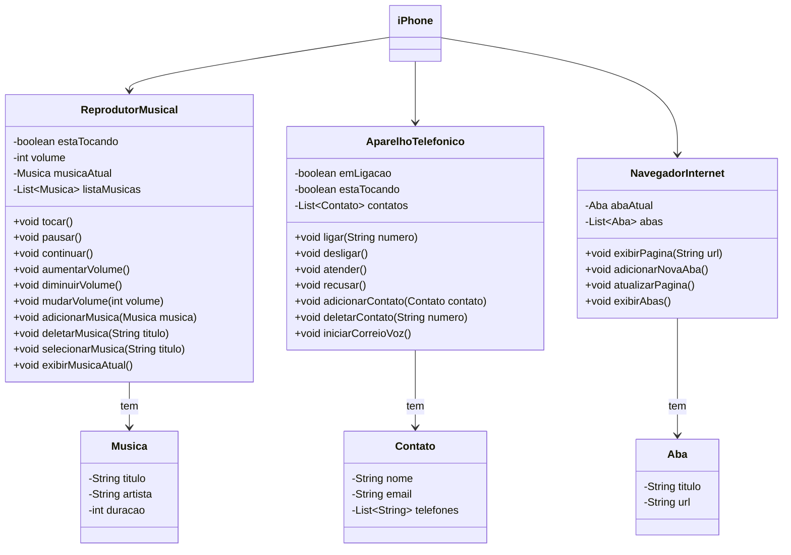
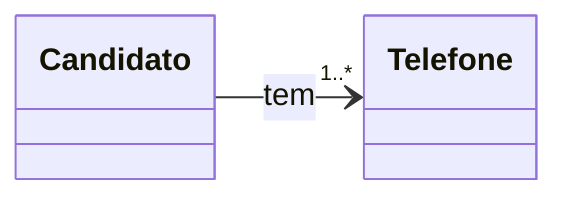
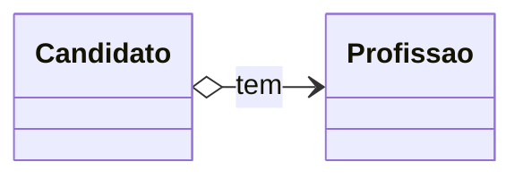
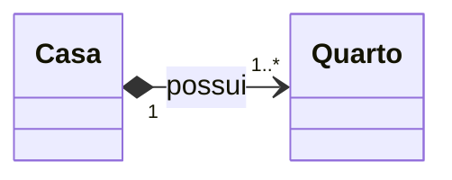

# 💻 Desafio: POO

## 🎯 Desafio

Funcionalidades a Modelar

1. Reprodutor Musical
    - Métodos: `tocar()`, `pausar()`, `selecionarMusica(String musica)`
2. Aparelho Telefônico
    - Métodos: `ligar(String numero)`, `atender()`, `iniciarCorreioVoz()`
3. Navegador na Internet
    - Métodos: `exibirPagina(String url)`, `adicionarNovaAba()`, `atualizarPagina()`

## 📌 Diagrama (Mermaid)

## 🧱 Ferramentas utilizadas

- `Mermaid`
- `Visual Studio Code`

## 🛠️ Links úteis

- [DIO](https://www.dio.me/)
- [Repositório do desafio](https://github.com/digitalinnovationone/trilha-java-basico/tree/main/desafios/poo)
- [Documentação Mermaid](https://mermaid.js.org/syntax/classDiagram.html)
- [Direções com Mermaid](https://jojozhuang.github.io/tutorial/mermaid-cheat-sheet/)

## 📓 Anotações

### Associação simples (agregação por padrão)

Um candidato pode possuir um ou mais telefones, mas não é dependente de um telefone em sua criação. Essa é uma forma mais simples de representação.

### Agregação

Um candidato pode ter uma profissão, mas não é obrigatório em sua criação. É possível informar isso em um outro momento. Um podem existir sem a necessidade do outro ser criado. A destruição de um não afeta o outro.

### Composição

Uma casa (todo) é composta por um ou mais quartos (partes). Os quartos só podem existir dentro da Casa. A destruição da casa resulta também na destruição dos quartos.

## 🧑🏻‍💻 Autor

- [GitHub](https://github.com/GracilianoOG)
- [LinkedIn](https://www.linkedin.com/in/gabrielgmbarros)
- [Frontend Mentor](https://www.frontendmentor.io/profile/GracilianoOG)